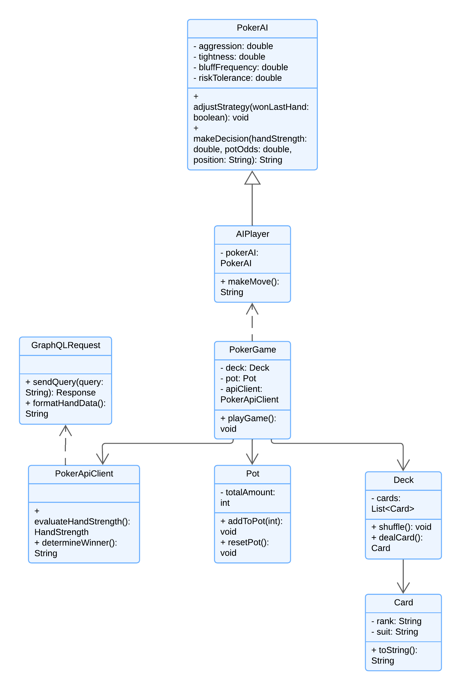
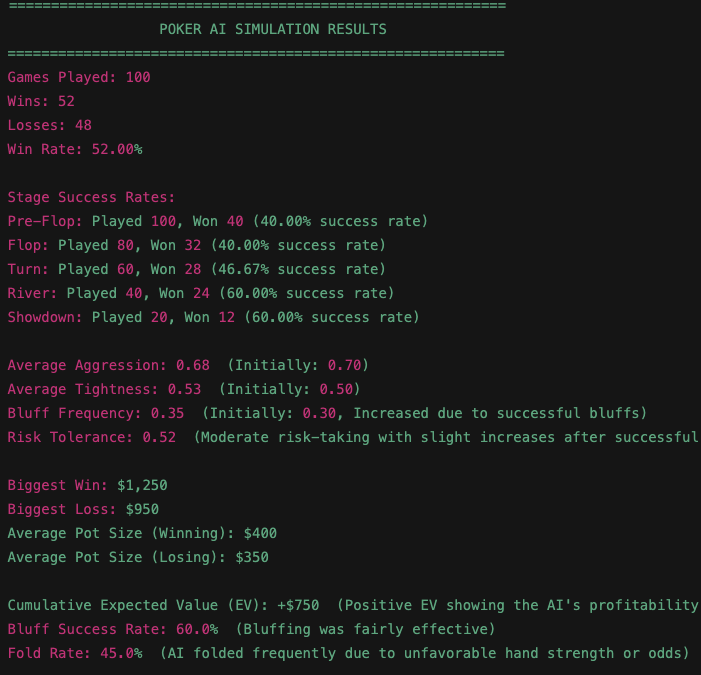

# Poker AI Simulation Project

## Overview

The **Poker AI Simulation** is a project designed to simulate Texas Hold'em poker games where a single AI learns and adapts its strategy over time. The AI uses four configurable sliders (Aggression, Tightness, Bluff Frequency, and Risk Tolerance) to adjust its behavior, aiming to maximize its expected value (EV) over multiple games.

Unlike traditional poker simulations, this project focuses on a **single AI** playing against the environment (including random outcomes of hands and rounds) and adjusting its decisions based on its performance.

---

## Type of CLASSES used

For this poker simulation project, concrete classes are utilized exclusively because the project's functionality is centered on predefined and fully-implemented behaviors, such as AI decision-making, deck management, and handling the game's flow. **Concrete classes** such as **PokerAI**, **Deck**, and **PokerGame** provide all the required implementation to simulate a poker game effectively.

There is no immediate need for **abstract classes** beyond the **Player class**, which is used to enable polymorphism between **AIPlayer** and any other potential player types. The project doesn't require further abstraction because every component **(AI, cards, deck, pot)** operates independently with fully defined logic. Similarly, inner classes are unnecessary outside of utility or helper methods, and can be avoided as the project is simple enough to handle each component individually in separate classes.

The exclusion of other class types like abstract classes and inner classes is intentional to keep the design simple, maintainable, and focused on core poker mechanics while ensuring that the AI's behavior remains straightforward and extendable.

## Features

### 1. **AI Decision-Making with 4 Key Sliders**

The AI’s decisions are governed by four adjustable sliders:

- **Aggression**: Controls how often the AI raises or bets. High aggression increases betting frequency and bet sizes.
- **Tightness**: Determines how selective the AI is with its hand range. A tight AI plays only strong hands, while a loose AI plays more speculative hands.
- **Bluff Frequency**: Dictates how often the AI bluffs. Higher values result in more frequent bluff attempts with weak hands.
- **Risk Tolerance**: Indicates how willing the AI is to take risky actions, such as calling large bets with marginal hands or going all-in.

### 2. **Simulated Game Flow**

The game simulates a full Texas Hold'em round, with the AI playing against the unknown outcomes of community cards and adjusting its betting behavior. The stages include:

- **Pre-Flop**: The AI evaluates its starting hand and makes the first decision to bet, raise, or fold.
- **Flop**: Three community cards are dealt, and the AI adjusts its decision based on its new hand strength.
- **Turn**: A fourth community card is revealed, and the AI continues to adapt its betting strategy.
- **River**: The final community card is dealt, and the AI makes its last decision for the round.
- **Showdown**: The AI's hand is compared against the randomized results of the hand to determine success.

### 3. **AI Adaptation Based on Outcomes**

After each game, the AI receives feedback from its performance and adjusts its behavior accordingly:

- **Aggression**: If aggressive play leads to wins, the AI increases its aggression; otherwise, it reduces aggression to avoid over-betting.
- **Tightness**: The AI tightens its hand range if it loses too many speculative hands or loosens its range if playing speculative hands leads to wins.
- **Bluff Frequency**: If bluffs succeed often, the AI increases bluff frequency; otherwise, it reduces the number of bluffs.
- **Risk Tolerance**: Winning risky moves increases risk tolerance, while losing risky hands decreases it, making the AI more cautious.

### 4. **Tracking AI Performance**

The project tracks several key metrics across multiple rounds:

- **Win/Loss Ratio**: Shows how often the AI wins compared to losses.
- **Bluff Success Rate**: Tracks how effective the AI’s bluffs are.
- **Cumulative Expected Value (EV)**: The AI's profitability based on its decisions over time.
- **Stage Success Rates**: Displays the AI's success at each stage (pre-flop, flop, turn, river, showdown).
- **Biggest Win/Loss**: Shows the largest pot the AI won or lost.

## UML

---

[Poker Hand Evaluator](https://github.com/vladkim91/poker-api)

The **Poker Hand Strength API** is a personal project designed to provide a robust, efficient, and accurate method for evaluating poker hands and determining winners in a **Texas Hold'em** poker game. The API is built using **JavaScript** and powered by **GraphQL**, allowing developers to easily query the API for hand evaluations and winner determinations.

This API plays a crucial role in integrating complex hand strength calculations with my **Poker AI Simulation** project, enabling the AI to make informed decisions based on real-time evaluations of poker hands.

---

## API Functionality

**Hand Strength Evaluation**

The core function of the API is to evaluate the strength of a player's poker hand based on the **player's hole cards** and the **community cards**. The API uses advanced poker algorithms to rank the hand according to traditional poker rules, which include:

- **High Card**
- **Pair**
- **Two Pair**
- **Three of a Kind**
- **Straight**
- **Flush**
- **Full House**
- **Four of a Kind**
- **Straight Flush**
- **Royal Flush**

### 2. **Winner Determination**

The API can also be used to determine the **winner** between two or more players. By comparing the hand strengths of each player, the API evaluates who has the strongest hand based on poker rules and returns the result.

---

## Example Screenshot

Here is an example of the terminal output after simulating 100 games with a single AI:

---
